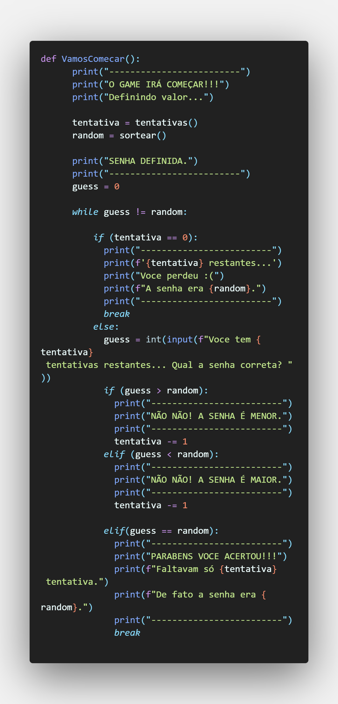

# **ACERTE A SENHA**

*Descrição da atividade*:
> Fazer um jogo que você deve **acertar uma senha** entre [MIN, > MAX], sendo que, você deve dar uma **dica para o jogador**, conforme a seguir:
> 
> Se o valor escolhido for menor que a senha: **"A SENHA É MAIOR"**
> 
>Se o valor escolhido for maior que a senha: **"A SENHA É MENOR"**
>
>O número máximo de tentativas são **7 chances**.

___
## Quer tentar?
-  Para testar baixe e instale python no seu computador:
> https://www.python.org/

- Baixe o arquivo: 
> AcertarNumeros.py
 
- No terminal digite:
> python3 AcertarNumeros.py

#### *Funcionando:*

___

##### Coloquei vários conhecimentos em **Python** para conseguir executar essa atividade como:
- Função;
- Sistema de Loop;
- Váriavel;
- Condional;
- Tratamento de erros;
- Entre muitos outros...

